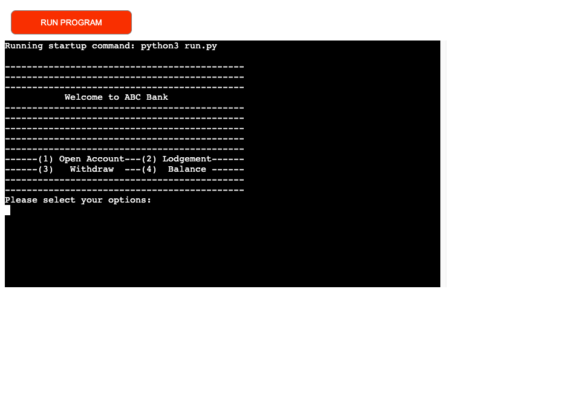

# ATM Project

--------------------------------------

## Table of Contents

--------------------------------------

- [Description](#description)
- [User Experience](#user-experience)
- [Lucidchart](#lucidchart)
- [Features](#features)
    - [Open Account](#open-account)
    - [Lodgement](#lodgement)
    - [Withdraw](#withdraw)
    - [Balance](#balance)
- [Testing](#testing-and-issues-encountered)
- [Technologies](#technologies-used)
- [Python Libraries/Modules](#python-libraries/modules)
- [Deployment](#deployment-to-heroku)
- [Credits](#credits)
- [Acknowledgments](#acknowledgments)

----------------------------------------

## Description
----------------------------------------

ATM project is based on the Python language. Users can open an account, lodge and withdraw money and check their account balance by selecting the ATM menu. All data can be read or saved to google sheets. The live site can be found [here](https://atm-project.herokuapp.com/).

----------------------------------------
## User Experience
----------------------------------------

### User Stories
----------------------------------------
As a first-time user:

- I want to know what functions are included in ATM.
- I want to get clear instructions to operate the machine.

As a returning user:

- I want to lodge and withdraw money from my bank account.
- I want to know the account balance.

----------------------------------------
## Lucidchart
----------------------------------------

For a logical statement of the ATM project, a lucidchart has been used to explain the working process of the machine clearly. Besides, it assists me with logical guidance to complete the project.

----------------------------------------
## Features
----------------------------------------

### Start menu

When running the program, a welcome page and start menu can be displayed on the screen clearly, which is easy to follow for the user to operate the machine. Users' requirements can be fulfilled by selecting the menu options.
  

----------------------------------------
#### Open account

When the user wants to open a bank account, option 1 is selected. The following information is required:

- Passport number. The format of the passport number example is listed clearly. The user's passport number will be verified by a regular expression. If the passport number is correct, the process will go next step. Otherwise, it will go back to the start menu.

- Phone number. There is an example for users. A regular expression of phone number is applied to validate the phone number. The process will go further as the validation is passed.

- Full name. If the user's full name is verified. It will come to the next procedure.

- Password. User has to set their 4 digital passwords. Verification is operated by a regular expression

- Confirm password. A confirmation of the password is required. The user has three times to confirm the password. If three times ran out, it will go back to start menu.

- Deposit. A deposit for the user's account is required. It allows the user to enter the amount of the deposit.

- Generate a random account number. If the previous steps went smoothly, the machine generates a random account number for the user.

- All the information from the user will be automatically saved to google sheets. 

----------------------------------------
#### Lodgement

When the user wants to lodge the money in their bank account, option 2 is selected. The following information is required:

- Account is required to verify if the user is our bank's customer or not. A try-except statement is used to avoid the user typing characters by accident.

- Password is tested when the user's account number is correct. Three are three times to try to input the password. If three times ran out, the account will be blocked and the user can't do anything unless contacting the bank.

- Lodgement will be successful when the account number and password are matched.

----------------------------------------
#### Withdraw

When the user wants to withdraw the money in their bank account, option 3 is selected. The user has to verify their account number and password. All the procedures are the same as the lodgement. The user can enter the withdrawn amount. When the user's withdrawn amount is greater than the balance. The insufficient balance will be shown on the screen.

----------------------------------------
#### Balance

When the user wants to check the balance of their account, option 4 is selected. The user has to verify their account number and password. All the procedures are the same as the lodgement. Then the balance will be shown on the screen.

--------------------------------------
## Testing 
--------------------------------------

The Python code of the ATM project has been tested by doing the following:

- Copy and paste the code to the PEP8 linter provided by Code Institute and confirmed there are no errors.
- Tested in my local terminal and the Code Institute Heroku terminal
- Type in various possible inputs to the terminal and there are no issues.

### Fixed Bugs

- When I set up the verify account number function, an undefined variable called account_number is merged due to the account_number variable has not passed to verify the account number function. Then the issue was fixed.
- When I want to verify the password input by the user, it always showed that the password typed by the user is not matched. However, it is supposed to be matched. Then I found that the returned verified password is an integer. But the extracted password from google sheets is strings. Therefore, it was not matched. Then I converted the integer to strings. There is no issue found after fixing that.

### Unfixed Bugs

- No bugs remaining

### Validator Testing

- No errors were found from PEP8online.com

----------------------------------------
## Technologies Used 
----------------------------------------

### Languages
- Python

### Tools
- Git
- GitHub
- Gitpod
- Heroku

----------------------------------------
## Python Libraries/Modules
----------------------------------------

- Time - to add the .sleep() function and delay my code in the terminal
- Re - to use a regular expression to judge if the user's input is correct.
- Random - to generate a random account number for the user.
- Gspread - as API for my Google Sheet

--------------------------------------
## Deployment to Heroku
--------------------------------------

The website was deployed by following the steps below: 

1. Log in [Heroku](https://id.heroku.com/login). 

2. Click 'New' and select 'Create new app'

3. Choose a name for the app, region and click on 'Create app'

4. Only 'Deploy' and 'Settings' are relevant from the menu section. Starting with the 'Settings' first.

5. Now Buildpacks need to be added. They install future dependencies that are needed outside of the requirements file. The first is Python and the second is node.js. Python needs to be selected first and then node.js. Save this selection.

6. Now the 'Deploy' section needs to be selected from the menu and connect to Git Hub.

7. Enter the name of the repository we want to connect it with and click 'Connect'

8. The choice appears now to either deploy using automatic deploys or manual deployment, which deploys the current state of the branch.

9. Click deploy branch. 

--------------------------------------
## Credits 
--------------------------------------

- Love Sandwiches from Code Institute - for general guidance and how to set up my API and import gspread to manipulate data from google sheets.
- [CSDN](https://blog.csdn.net/qq_15437625/article/details/98601019) - for the regular expression of a passport number.

--------------------------------------
## Acknowledgments
--------------------------------------

Many thanks to the student care from the Code Institute for assisting me to solve the bugs and give me suggestions to optimize my code. At the same, I want to thanks my family to support me in using my spare time to learn coding.