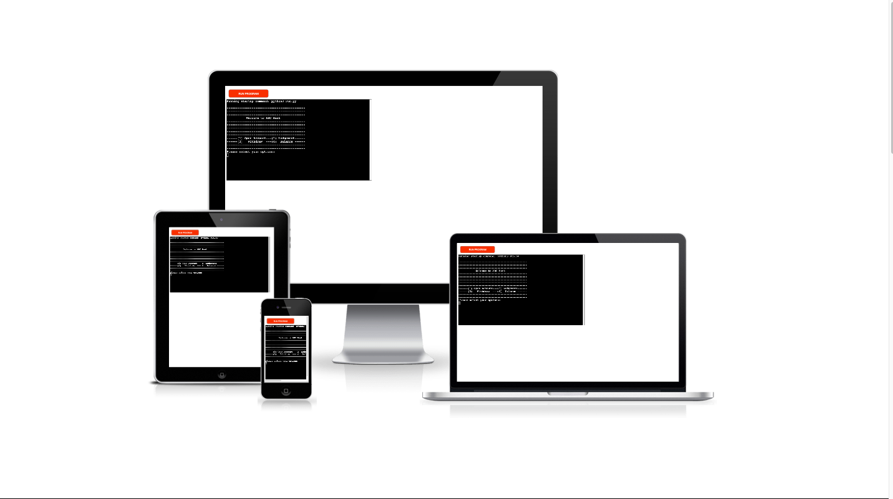
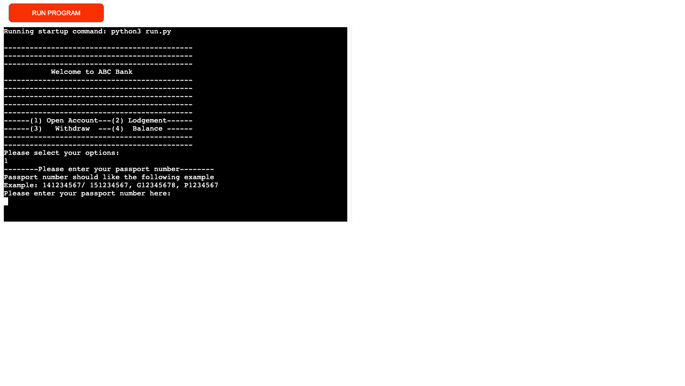

# ATM Project

--------------------------------------

## Table of Contents

--------------------------------------

- [Description](#description)
- [User Experience](#user-experience)
- [Lucidchart](#lucidchart)
- [Features](#features)
    - [Future Features](#future-features)
- [Testing](#testing-and-issues-encountered)
- [Technologies](#technologies-used)
- [Deployment](#deployment-to-heroku)
- [Credits](#credits)

----------------------------------------

## Description
----------------------------------------

ATM project is based on the Python language. Users can open an account, lodge and withdraw money and check their account balance by selecting the ATM menu. All data can be read or saved to google sheets. The live site can be found [here](https://atm-project.herokuapp.com/).

----------------------------------------
## User Experience
----------------------------------------

### User Stories
----------------------------------------
As a first-time user:

- I want to know what functions are included in ATM.
- I want to get clear instructions to operate the machine.

As a returning user:

- I want to lodge and withdraw money from my bank account.
- I want to know the account balance.

----------------------------------------

### Lucidchart
----------------------------------------

For a logical statement of the ATM project, a lucidchart has been used to explain the working process of the machine clearly. Besides, it assists me with logical guidance to complete the project.

----------------------------------------
## Features
----------------------------------------

### Start menu

When running the program, a welcome page and start menu can be displayed on the screen clearly, which is easy to follow for the user to operate the machine. Users' requirements can be fulfilled by selecting the menu options.
  

----------------------------------------
#### Open account

When the user wants to open a bank account, option 1 is selected. The following information is required:

- Passport number. The format of the passport number example is listed clearly. The user's passport number will be verified by a regular expression. If the passport number is correct, the process will go next step. Otherwise, it will go back to the start menu.

- Phone number. There is an example for users. A regular expression of phone number is applied to validate the phone number. The process will go further as the validation is passed.

- Full name. If the user's full name is verified. It will come to the next procedure.

- Password. User has to set their 4 digital passwords. Verification is operated by a regular expression

- Confirm password. A confirmation of the password is required. The user has three times to confirm the password. If three times ran out, it will go back to start menu.

- Deposit. A deposit for the user's account is required. It allows the user to enter the amount of the deposit.

- Generate a random account number. If the previous steps went smoothly, the machine generates a random account number for the user.

----------------------------------------
#### Lodgement

When the user wants to lodge the money in their bank account, option 2 is selected. The following information is required:

- Account is required to verify if the user is our bank's customer or not. A try-except statement is used to avoid the user typing characters by accident.

